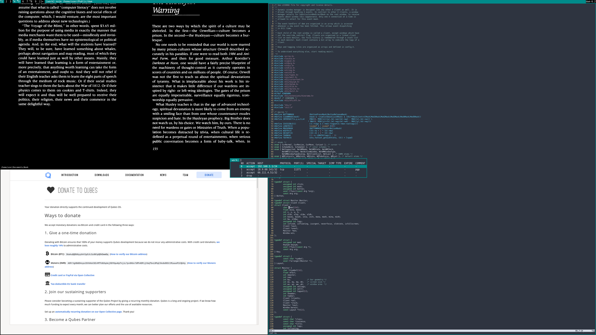
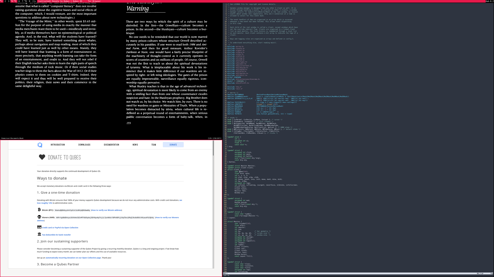

How to install suckless' dwm in QubesOS
=======================================

This guide will show you how to install suckless' [dwm](https://dwm.suckless.org) in [QubesOS](https://qubes-os.org) by modifying and compiling dwm inside a domU qube and then
[copying](https://www.qubes-os.org/doc/how-to-copy-from-dom0/#copying-to-dom0) the resulting binary to dom0.

---------------------------------------

<!--ts-->
   * 1 [Build Enviroment](#build-enviroment)
   * 2 [Downloading dwm](#downloading-dwm)
   * 3 [Modifying dwm](#modifying-dwm)
     * 3.1 [Adding qubesdecorations](#adding-qubesdecorations)
     * 3.2 [Maintaining dwm configuration and customization in git](#maintaining-dwm-configuration-and-customization-in-git)
   * 4 [Installing dwm](#installing-dwm)
   * 5 [Starting dwm](#starting-dwm)
   * 6 [Tips and tricks](#tips-and-tricks)
     * 6.1 [Automatic login](#automatic-login)
     * 6.2 [Applying dwm rules based on label and qube name](#applying-dwm-rules-based-on-label-and-qube-name)
     * 6.3 [Better fullscreen mode](#better-fullscreen-mode)
     * 6.4 [Launching domU applications via dmenu](#launching-applications-via-dmenu)
     * 6.5 [Managing QubesOS via dmenu](#managing-qubesos-via-dmenu)
     * 6.6 [Quick-starting domU terminals](#quick-starting-domu-terminals)
     * 6.7 [Systray](#systray)
   * [Author](#author)
<!--te-->

# Build Enviroment

As we need to compile dwm ourselves in order to modify it, we need to get some tools and create suitable work-environment. Therefore we will create a domU qube for the sole purpose of modifying and compiling dwm.
This has the benefit of not needing to install all the developement- and version control tools inside dom0 and it also massively lessens the amount of files that we have to copy to dom0.

First, create an AppVM- or StandaloneVM qube which is able to connect to the internet, based on a known good, free from proprietary software, TemplateVM qube.
This guide will use a debian-based StandaloneVM qube, called "build-dwm". 
You must ensure that the TemplateVM qube that this qube is based on is secure. If you create it as an AppVM qube, you also have to ensure that its TemplateVM qube _stays_ secure, as you might come back to modify and recompile your setup.
Do not use this qube for anything else! Failing to prevent this qube from getting compromised will open the door for a targeted attack to compromise your complete system!
Use the [Qubes firewall](https://qubes-os.org/doc/firewall) to secure it against unwanted and unneccessary connections.

Optionally, it is possible to further shield "build-dwm" by isolating it completely from any networking and refrain from installing any networking related or otherwise unnessecary software inside it.
Using a fresh DiposableVM qube, started from a known good TemplateVM qube, you can download dwm and your selected patches,
[copy](https://qubes-os.org/doc/copying-files) them to "build-dwm" and proceed from there.
If you are not able to adjust your procedure according to this short explanation when following further along,
I urge you to aquire a better understanding of the QubesOS internals before making any non-trivial modifications to dom0!

Install the build dependencies:

    [@build-dwm ~]# apt install libx11-dev libxft-dev libxinerama-dev

Install the version control and build tools:

    [@build-dwm ~]# apt install git make tcc

# Downloading dwm

Clone dwm with git:

    [@build-dwm ~/Desktop]$ git clone https://git.suckless.org/dwm

Create a branch to track your customizations:

    [@build-dwm ~/Desktop/dwm]$ git branch my_dwm

# Modifying dwm

Switch to your personal branch:

    [@build-dwm ~/Desktop/dwm]$ git checkout my_dwm

## Adding qubesdecorations

The qubesdecorations patch enables dwm to read QubesOS specific windowproperties and use the windowborders, titlebar and tagbar to indicate to the user what qube the focused window belongs to.

Download and apply the qubesdecorations patch:

    [@build-dwm ~/Desktop]$ git clone https://github.com/3o14r473/dwm-qubesdecorations.diff

    [@build-dwm ~/Desktop/dwm]$ git apply ../dwm-qubesdecorations.diff/dwm-qubesdecorations-6.3.diff

    [@build-dwm ~/Desktop/dwm]$ git add .

    [@build-dwm ~/Desktop/dwm]$ git commit -m 'Apply patch: qubesdecorations'

Now we have a dwm build that is able to indicate to the user what window belongs to which qube.
The colorscheme for each qubelabel can be configured inside config.def.h.

So far, this is a very minimal setup and most readers probably want to atleast follow [6.2](#applying-dwm-rules-based-on-label-and-qube-name), [6.3](#better-fullscreen-mode), [6.4](#launching-applications-via-dmenu)
and [6.6](#quick-starting-domu-terminals) down below in the Tips and tricks section.
Feel free to further configure this build before proceeding, but it is possible to come back here at any point in time to adjust and recompile the latest iteration of your personal dwm build.

## Maintaining dwm configuration and customization in git

Whenever you want to modify or update your dwm configuration, simply boot up your build-dwm qube and follow the same procedure we use above.
Recording your changes with git makes for a great overview of your modifications and lets you experiment with your setup.
[Here](https://dwm.suckless.org/customisation/patches_in_git/) is a summary of the concept by suckless.

If you want to revert any changes introduced by a patch or your own doing, you are able to conviniently [revert](https://git-scm.com/docs/git-revert) the related commit, [reset](https://git-scm.com/docs/git-reset) the current HEAD or apply the related patch [in reverse](https://git-scm.com/docs/git-apply#Documentation/git-apply.txt--R).

# Installing dwm

Compile the binary:

    [@build-dwm ~/Desktop/dwm]# make clean install

Copy it to dom0:

    [@dom0 ~]$ qvm-run --pass-io --no-color-output build-dwm 'cat /usr/local/bin/dwm' > /tmp/dwm

    [@dom0 ~]# cp /tmp/dwm /usr/local/bin/dwm

    [@dom0 ~]# chmod 755 /usr/local/bin/dwm   # This step can be skipped when reinstalling

# Starting dwm

This guide will use [xinit](https://en.wikipedia.org/wiki/xinit) to start dwm. Feel free to use a display manager or any other method instead.

Create a file called `.xinitrc` inside your home directory in dom0 with the following contents:

	#!/bin/sh

	for i in /etc/xdg/autostart/*.desktop; do

		if ! grep -q "OnlyShowIn=" "$1"; then

			$(grep "^Exec=" "$1" | cut -c 6-)&
		fi
	done

	qui-clipboard&
	qui-devices&
	qui-disk-space&
	qui-domains&
	qui-updates&

	# (...)

	exec dwm #>> "$HOME"/.logs/dwm/$(date +%Y-%m-%d_%H-%M).log

Make it executable:

    [@dom0 ~]$ chmod +x .xinitrc

You can [customize your .xinitrc to run any programs on X server startup.](https://wiki.archlinux.org/index.php/Xinit#xinitrc). Use this to start programs like a notification daemon and to apply configuration options at startup for example.

Furthermore, as dwm reads from the root window's name to print arbitrary status text, a simple while loop, forked to the background, inside .xinitrc, can be utilized to [dynamically update](https://wiki.archlinux.org/index.php/Dwm#Statusbar_configuration) this status text.

Disable LightDM:

    [@dom0 ~]# systemctl disable lightdm

...and done :)

Reboot and either [autostart X at login](https://wiki.archlinux.org/index.php/Xinit#Autostart_X_at_login) or manually start it with the `startx` command.

# Tips and tricks

## Automatic login

If you use xinit, you can [automatically](https://wiki.archlinux.org/title/Getty#Automatic_login_to_virtual_console) login to the virtual console, without providing a username and password everytime.

## Applying dwm rules based on label and qube name

Apply [this](https://github.com/3o14r473/dwm-qubesrules.diff) patch to allow dwm to use label and qube name in its rulematching.

## Better fullscreen mode

As QubesOS uses the window decorations and titlebar to indicate to the user what window belongs to which qube,
the Qubes GUI virtualization daemon, by default, restricts all qubes from “owning” the full screen,
ensuring that there are always clearly marked decorations drawn by the trusted window manager around each window. 

In XFCE, you can always put a window into fullscreen mode using the trusted window manager by right-clicking on a window’s title bar and selecting “Fullscreen” or pressing <alt+f11>.
In my opinion, this is very cumbersome. Atleast in practice I have experienced it very often as pretty clunky.

But thanks to [Jan Hendrik Farr](farrjanhendrik@aol.de), we can apply the [fakefullscreen](https://dwm.suckless.org/patches/fakefullscreen/) patch to enable dwm to handle fullscreened windows in a sane way.
Originally intended to [enable](whichshoulddefinitelybethedefault...) dwm to display applications in their respective fullscreen mode inside windows of varying size, this patch lends itself immaculately for this QubesOS specific need.
With this patch, dwm only allows applications to enter fullscreen mode inside their assigned window areas in which they still have to obey whatever the trusted window manager,
and thus the user, dictates them to.
While preventing windows from "owning" the whole screen via fullscreen mode, fullscreened windows can still be effortlessly and very quickly moved and resized as one wishes, using the comfy dwm mechanics.

After applying this patch, [enable](https://www.qubes-os.org/doc/full-screen-mode/#enabling-full-screen-mode-for-select-vms-1) fullscreen mode globally.
And remember to disable this again, whenever you intend to switch to another window manager!

## Launching domU applications via dmenu

The default `dmenu_run` script is unable to list and launch applications within domU qubes, use [qmenu-am](https://github.com/3o14r473/qmenu#qmenu-am) instead.

## Managing QubesOS via dmenu

To keep your fingers on the keyboard, you can use [qmenu-vm](https://github.com/3o14r473/qmenu#qmenu-vm) and [qmenu-dm](https://github.com/3o14r473/qmenu#qmenu-dm) as dmenu drop-in replacements for the Qube Manager and Device Manager respectivily.

## Quick-starting domU terminals

By default, <MODKEY+Return> will have dwm try to spawn st in dom0. But you certainly want to spawn st, or other terminal emulators, in many different domU qubes.
One such way is by spawning a terminal emulator inside a qube, based on what qube the currently focused window belongs to.

If you want to use the same terminal emulator for every domU qube, you can go with this little script:

	#!/bin/sh

	qube=$(xprop -id $(xdotool getwindowfocus) _QUBES_VMNAME | cut -d\" -f2)

	if [ "$qube" = '_QUBES_VMNAME:  not found.' ]; then

		$1&
	else
		qvm-run "$qube" $2&
	fi

Use it as follows:

    /usr/local/bin/qxterm [dom0 terminal emulator] [domU terminal emulator]

If you intend to use different terminal emulators for some domU qubes, you will have to use something more complex like this: 

	#!/bin/sh

	try_term='
		for t in $TERMINAL alacritty aterm cutecom eterm foot konsole kitty mlterm moserial qterm rxvt st stterm terminology urxvt xterm yakuake zutty germinal gnome-terminal guake kermit lxterminal mate-terminal pantheon-terminal roxterm sakura terminator termite tilda tilix xfce4-terminal; do
		which $t > /dev/null 2>&1 && exec $t;
		done
	'

	qube=$(xprop -id $(xdotool getwindowfocus) _QUBES_VMNAME | cut -d\" -f2)

	if [ "$qube" = '_QUBES_VMNAME:  not found.' ]; then

		$1&
	else
		qvm-run "$qube" "bash -c '$try_term'"
	fi
	

Use it as follows:

    /usr/local/bin/qxterm [dom0 terminal emulator]

## Systray

dwm comes without a systray, you can use [this](https://dwm.suckless.org/patches/systray/) patch to implement one.

# Author

* 3o14r473 - [fingerprint](E4FEE61C3B02F4CAB6D80CA7F105757D34BEFA98) [email](3o14@pm.me) [moneroj](41rMoMLvk8hEJYP2vbv3dNUGzN95CLXoANAtmAVaUxzse5KfPjhkE7d4PUwh8kCkF16FwwqfZTmS4ZKmYCjrsFAcGXTPpwH)
